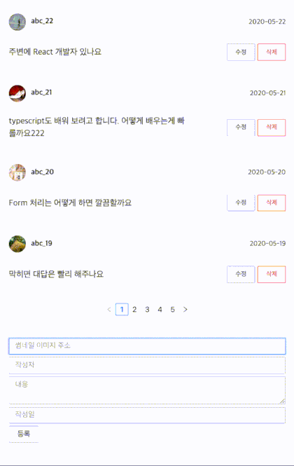

# 코멘트 컴포넌트



json-server API를 활용하여 댓글 기능을 Typescript와 Redux-saga를 사용하여<br/>
코멘트 리스트 불러오기, 작성, 수정, 삭제 구현

## API 명세

| method | url                   | 설명      |
| ------ | --------------------- | --------- |
| GET    | / comments            | 댓글 목록 |
| GET    | /comments/{commentId} | 개별 댓글 |
| POST   | /comments             | 댓글 작성 |
| PUT    | /comments/{commentId} | 댓글 수정 |
| DELETE | /comments/{commentId} | 댓글 삭제 |

## 실행

**서버 실행**

```console
$ npx json-server ./data.json --port 4000
```

**프로젝트 의존성 모듈 설치**

```console
$ yarn install

    or

$ npm install
```

**프로젝트 실행**

```console
$ yarn start

    or

$ npm start
```
